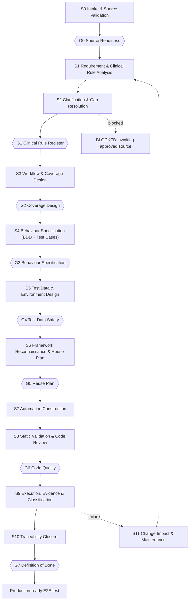

# E2E Test Generation Workflow

**Version:** 1.0
**Status:** Draft — pending approval at Gate G0
**Scope:** Clinical Project E2E Test Generation and Automation
**Process:** AIDLC
**Governed by:** `aidlc-docs/rules/aidlc-e2e-rules.md` + `aidlc-docs/rules/clinical-rules.md`

---

## 1. Purpose

This document defines the operational workflow that turns an approved clinical requirement into an executed, traceable Playwright E2E test.

It defines only the **process**: stages, inputs, outputs, approval gates, artifacts, and blocking conditions.

It deliberately does **not** contain test cases, BDD scenarios, or automation code. Those are produced by executing the stages below, each behind its own approval gate.

---

## 2. Governing Rules and Precedence

This workflow is subordinate to the two rules documents. Where this workflow and a rule disagree, the rule wins.

Precedence order:

```text
clinical-rules.md          (strictest — wins on conflict, per clinical-rules.md §1)
        >
aidlc-e2e-rules.md
        >
this workflow document
```

Behavioural source-of-truth precedence is defined in `aidlc-e2e-rules.md` §3 and `clinical-rules.md` §3 and is **not** restated or reinterpreted here. Lower-priority sources MUST NOT override higher-priority sources, and AI-generated content is never an approved source.

---

## 3. Prerequisite Status — Blocking Findings

A reconnaissance of this repository was performed as required by `aidlc-e2e-rules.md` §14 and §22. Current repository contents:

```text
README.md                                        (title + frontend UI URL)
.gitignore
aidlc-docs/rules/aidlc-e2e-rules.md              POPULATED
aidlc-docs/rules/clinical-rules.md               POPULATED
aidlc-docs/workflows/e2e-test-generation-workflow.md   (this file)
aidlc-docs/requirements/requirement-template.md  POPULATED
aidlc-docs/construction/generate-bdd.md          POPULATED
aidlc-docs/construction/generate-testcase.md     POPULATED
aidlc-docs/construction/generate-playwright.md   POPULATED
aidlc-docs/schemas/traceability.schema.json      POPULATED
```

Accordingly, the following are recorded per the No Assumption Rule (`aidlc-e2e-rules.md` §4):

```text
MISSING INFORMATION
```

| # | Missing input | Blocks from | Required from |
|---|---|---|---|
| P-01 | No approved requirements exist in `aidlc-docs/requirements/` | S1 onward | Product / BA |
| ~~P-02~~ | ~~`requirement-template.md` is empty~~ — **RESOLVED**, template authored; pending ratification at G0 | S0 onward | QA Lead / BA |
| ~~P-03~~ | ~~`traceability.schema.json` is empty~~ — **RESOLVED**, JSON Schema authored and validator-verified; pending ratification at G0 | S10 (and validation at every gate) | QA Lead / Eng Lead |
| P-04 | Partially addressed — framework infrastructure exists as a proposal (`playwright.config.ts`, `tsconfig.json`, layout and conventions in `tests/README.md`), but there are still no fixtures, Page Objects, API clients, or authentication utilities, because building them requires application access and an API contract that do not exist. Five architecture decisions (F-01 to F-05) remain open | S6, S7 | Eng Lead / Automation Lead |
| P-05 | Partially addressed — a dev frontend URL is recorded in `README.md`, but there is still no API contract, no credential/role provisioning for test accounts, and no defined test environment policy | S5, S9 | Eng Lead / Product |
| P-06 | No module taxonomy is approved, so the `<MODULE>` token in `REQ-<MODULE>-<NNN>` / `TC-<MODULE>-<NNN>` cannot be populated. A candidate list awaits ratification at `aidlc-docs/requirements/module-taxonomy.md`, including an unresolved question on whether `CLIENT` and `PATIENT` are the same entity | S1 onward | Product / QA Lead |
| P-07 | No clinical lifecycle/state model, enum set, or role-and-permission matrix is available in an approved source | S3, S4 | Clinical SME / Product |

**Consequence:** stages S1 through S10 remain blocked while P-01, P-04, P-05, P-06, and P-07 are open. Stage S0 is the only executable stage, and even it cannot run against a real requirement until P-01 and P-06 are closed. This is the intended behaviour of the rules, not a workflow defect.

The construction prompts (`generate-bdd.md`, `generate-testcase.md`, `generate-playwright.md`) are now authored and are the operational instructions for stages S4 and S7. They are subject to ratification at Gate G0 along with this workflow. Note that `generate-playwright.md` is written but **not runnable**, because P-04 leaves it with no framework to inspect or reuse.

---

## 4. Conflict Register

Per `aidlc-e2e-rules.md` §3 ("If sources conflict, AI MUST report the conflict instead of choosing an interpretation") the following are reported rather than resolved.

### C-01 — BDD/Test Case ordering

```text
CONFLICTING REQUIREMENTS
```

**Rule:** `aidlc-e2e-rules.md` §2 orders the pipeline as `... Workflow → BDD Scenario → Test Case → Automation`, placing BDD **before** test cases.

`aidlc-e2e-rules.md` §5 (traceability) and §31 (Definition of Done) both order it `... Test Case → BDD Scenario → Playwright`, placing test cases **before** BDD. The prior skeleton of this workflow file also implied BDD first, then QA review, then test cases.

**Problem:** the two orderings imply different authoring sequences and different review artifacts at the gate.

**Required decision:** confirm which artifact is authored first, or confirm that they are co-produced.

**Decision (recorded; to be ratified at G0):** stage S4 treats BDD scenarios and test cases as a **single co-produced deliverable reviewed at one gate (G3)**. This satisfies every cited rule because both artifacts exist and are mutually traceable before automation begins, and it avoids this workflow picking an interpretation of the sequencing.

The underlying inconsistency between §2 and §5/§31 still exists in `aidlc-e2e-rules.md` and SHOULD be corrected at source so future readers are not misled. If a reviewing authority later prefers a strict sequence, S4 splits into S4a and S4b with an added gate.

### C-02 — Rules path reference

`clinical-rules.md` §1 references the general rules at `aidlc/rules/AIDLC_E2E_RULES.md`. The actual path in this repository is `aidlc-docs/rules/aidlc-e2e-rules.md` (different directory, different casing). Cosmetic, but it should be corrected in one place or the other so tooling can resolve references.

---

## 5. Stage Model Overview



Summary table:

| Stage | Name | Primary output | Gate |
|---|---|---|---|
| S0 | Intake & Source Validation | Intake record | G0 |
| S1 | Requirement & Clinical Rule Analysis | Requirement analysis, clinical rule register | — |
| S2 | Clarification & Gap Resolution | Clarification log, blocking register | G1 |
| S3 | Workflow & Coverage Design | Coverage matrix, scenario inventory, duplication report | G2 |
| S4 | Behaviour Specification | BDD feature files, test case specs | G3 |
| S5 | Test Data & Environment Design | Test data plan | G4 |
| S6 | Framework Reconnaissance & Reuse Plan | Reuse plan | G5 |
| S7 | Automation Construction | Playwright code, step definitions | — |
| S8 | Static Validation & Code Review | Validation report, review record | G6 |
| S9 | Execution, Evidence & Classification | Execution report, evidence bundle, classification | — |
| S10 | Traceability Closure | Traceability record | G7 |
| S11 | Change Impact & Maintenance | Impact analysis | re-enters at G1/G2 |

---

## 6. Stage Definitions

### S0 — Intake & Source Validation

**Purpose:** confirm that a candidate requirement is approved and that the inputs needed downstream actually exist, before any analysis effort is spent.

**Inputs**
- Candidate requirement reference
- `aidlc-docs/requirements/requirement-template.md` (authored; ratify at G0)
- Both rules documents

**AI actions**
- Verify the requirement exists and carries an explicit approved status.
- Verify it conforms to the approved requirement template.
- Verify a `REQ-<MODULE>-<NNN>` ID is assigned (`aidlc-e2e-rules.md` §12).
- Inventory which downstream inputs are present vs missing (API contracts, UX specs, lifecycle model, role matrix, environment).
- Emit `MISSING INFORMATION` with a specific list for anything absent. Do not proceed on partial inputs.

**Outputs / artifacts**
- `aidlc-docs/intake/<REQ-ID>/intake-record.md`

**Gate:** G0
**Blocking conditions:** requirement not approved; no requirement ID; template non-conformance; any downstream input required by the requirement type is missing.

---

### S1 — Requirement & Clinical Rule Analysis

**Purpose:** extract, without interpretation, what the approved sources actually state.

**Inputs**
- Approved requirement (from S0)
- Approved business/clinical rules, acceptance criteria, API contracts, UX specs, data rules

**AI actions**
- Enumerate acceptance criteria and assign `AC-<NNN>` identifiers.
- Extract each clinical/business rule into a register, each row citing its approved source document and location.
- Extract, **by citation only**, the lifecycle states, enums, mandatory fields, roles/permissions, calculation definitions, date/time rules, and audit expectations that the sources define (`clinical-rules.md` §9–§18, §25, §16).
- Mark anything not found as `NOT SPECIFIED` — never fill it in (`clinical-rules.md` §2, §33).
- Identify conflicts between sources and record them; do not choose a winner.

**Outputs / artifacts**
- `aidlc-docs/analysis/<REQ-ID>/requirement-analysis.md`
- `aidlc-docs/analysis/<REQ-ID>/clinical-rule-register.md` — every entry carries a source citation
- `aidlc-docs/analysis/<REQ-ID>/conflict-register.md`

**Gate:** none directly; feeds S2.
**Blocking conditions:** none at this stage — S1 is allowed to surface gaps, which is its purpose.

---

### S2 — Clarification & Gap Resolution

**Purpose:** drive every ambiguity to a human decision before any expected outcome is written down.

**Inputs:** S1 outputs.

**AI actions**
- For each ambiguity, raise a clarification item in the exact form required by `clinical-rules.md` §4:

```text
CLINICAL RULE REQUIRES CLARIFICATION

Rule:
<unclear rule>

Problem:
<what is unclear>

Required decision:
<what needs to be confirmed>
```

- Route each item to the correct authority (Clinical SME, Product Owner, BA, QA Lead, Eng Lead).
- Hold any test whose expected clinical behaviour depends on an open item in `TEST BLOCKED`.
- Record every resolution with decider, date, and rationale — a resolved decision becomes an approved source for downstream stages.

**Outputs / artifacts**
- `aidlc-docs/analysis/<REQ-ID>/clarification-log.md`
- `aidlc-docs/analysis/<REQ-ID>/blocked-register.md`

**Gate:** G1
**Blocking conditions:** any open clarification that affects expected clinical behaviour. Items that do not affect expected behaviour may be carried forward with explicit sign-off.

---

### S3 — Workflow & Coverage Design

**Purpose:** decide *what* to test and prove that the set is both sufficient and minimal.

**Inputs:** approved clinical rule register, acceptance criteria, resolved clarifications.

**AI actions**
- Model the business workflow across the layers named in `aidlc-e2e-rules.md` §8.
- Propose scenarios across the categories in `aidlc-e2e-rules.md` §7 and the clinical paths in `clinical-rules.md` §23: happy path, validation, authorization, state, recovery.
- Map every acceptance criterion to proposed coverage and explicitly label each as covered, partially covered, or `NOT COVERED` (`aidlc-e2e-rules.md` §6). Claiming full coverage while any criterion is uncovered is prohibited.
- Run duplicate detection against existing tests and mark each candidate `REUSE EXISTING TEST`, `EXTEND EXISTING TEST`, or new (`aidlc-e2e-rules.md` §27).
- Assign P0–P3 priority per `aidlc-e2e-rules.md` §13.
- Justify each scenario's business value; scenarios that exist only to raise test count are rejected (§7, §32).

**Outputs / artifacts**
- `aidlc-docs/design/<REQ-ID>/coverage-matrix.md`
- `aidlc-docs/design/<REQ-ID>/scenario-inventory.md`
- `aidlc-docs/design/<REQ-ID>/duplication-report.md`

**Gate:** G2
**Blocking conditions:** uncovered acceptance criteria without an accepted justification; unresolved duplication; scenarios whose expected outcome traces to no approved source.

---

### S4 — Behaviour Specification (BDD Scenarios + Test Cases)

**Purpose:** express approved behaviour in business language and in executable-test terms.

See conflict **C-01** — BDD scenarios and test cases are co-produced and reviewed together at G3 pending a decision on strict ordering.

**Inputs:** approved coverage matrix and scenario inventory; the construction prompts `aidlc-docs/construction/generate-bdd.md` and `generate-testcase.md`.

**AI actions**
- Write Gherkin in business language, free of selectors, endpoints, and status codes (`aidlc-e2e-rules.md` §9), following the Given/When/Then structure of §10, one business behaviour per scenario.
- Author a test case per scenario containing every field mandated by `aidlc-e2e-rules.md` §11: Test Case ID, Requirement ID, Scenario, Objective, Preconditions, Test Data, Steps, Expected Results, Priority, Test Type, Traceability, Automation Status.
- Assign deterministic `TC-<MODULE>-<NNN>` IDs (§12).
- Validate expected results against error-message rules — exact text only where the requirement specifies exact text, otherwise assert behaviour (`clinical-rules.md` §24).
- Ensure each test case is independently executable (§17).

**Outputs / artifacts**
- `aidlc-docs/bdd/<module>/<REQ-ID>.feature`
- `aidlc-docs/testcases/<REQ-ID>/TC-<MODULE>-<NNN>.md`

**Gate:** G3 — this is the `Approved → Automation` boundary of `clinical-rules.md` §35. No automation may begin before it.
**Blocking conditions:** any expected outcome not traceable to an approved source; invented error text, enum value, or state; implementation detail leaking into Gherkin.

---

### S5 — Test Data & Environment Design

**Purpose:** define safe, deterministic data before it is embedded in code.

**Inputs:** approved test cases; approved data rules and API contracts; environment definitions.

**AI actions**
- Specify data that is deterministic, synthetic, isolated, and environment-safe (`aidlc-e2e-rules.md` §18).
- Confirm zero real PHI across every field class listed in `clinical-rules.md` §6.
- Define per-test setup and cleanup so tests never mutate shared clinical data (`clinical-rules.md` §7).
- Define patient/session/program association fixtures required by `clinical-rules.md` §21 and §22.
- Specify which setup may go through the API and which must go through the UI, enforcing the no-shortcut rule (`clinical-rules.md` §31, `aidlc-e2e-rules.md` §20).
- Reference credentials only through the approved secret mechanism; never inline (`aidlc-e2e-rules.md` §19).
- Emit `MISSING TEST DATA DEFINITION` where a value has no approved source.

**Outputs / artifacts**
- `aidlc-docs/testdata/<REQ-ID>/test-data-plan.md`
- `aidlc-docs/testdata/<REQ-ID>/phi-safety-attestation.md`

**Gate:** G4
**Blocking conditions:** any real or realistic-but-unverified patient data; any hardcoded credential; undefined cleanup for data-mutating tests.

---

### S6 — Framework Reconnaissance & Reuse Plan

**Purpose:** satisfy the mandatory inspect-before-build step of `aidlc-e2e-rules.md` §14 and §22.

**Inputs:** existing automation framework — currently infrastructure only (config and conventions); no reusable components yet exist to inspect (**P-04**).

**AI actions**
- Inventory existing fixtures, Page Objects, components, API clients, auth utilities, and conventions.
- Map each approved test case to the components it will reuse.
- Justify every proposed new component by showing no existing one suffices (§14, §22).
- Plan the smallest maintainable change.

**Outputs / artifacts**
- `aidlc-docs/automation/<REQ-ID>/framework-reuse-plan.md`

**Gate:** G5
**Blocking conditions:** proposed duplication of existing infrastructure; no framework in place (current state — the framework must be established and approved as its own work item first).

---

### S7 — Automation Construction

**Purpose:** implement the approved specification.

**Inputs:** approved BDD + test cases, test data plan, reuse plan; the construction prompt `aidlc-docs/construction/generate-playwright.md`.

**AI actions**
- Generate TypeScript Playwright code following the existing architecture and conventions (`aidlc-e2e-rules.md` §14).
- Apply the locator preference order of §15; avoid `nth-child()` and deep nesting.
- Use only condition-based synchronization; no `page.waitForTimeout(...)` absent a documented technical reason (§16).
- Keep tests order-independent and repeatable (§17).
- Limit database assertions to cases where persistence integrity is explicitly part of the requirement (§21).
- Implement setup/cleanup exactly as specified in the approved test data plan.
- Carry `REQ-ID` and `TC-ID` into test metadata/tags so traceability survives into execution reports.

**Outputs / artifacts**
- Playwright specs, step definitions, and any approved new Page Objects/fixtures, at paths defined by the framework once it exists
- `aidlc-docs/automation/<REQ-ID>/implementation-notes.md`

**Gate:** none directly; flows into S8.
**Blocking conditions:** deviation from the approved specification. Any behavioural change discovered as necessary returns to S2/S4 rather than being absorbed in code.

---

### S8 — Static Validation & Code Review

**Purpose:** the `Static Validation → QA Review → Code Review` segment of `aidlc-e2e-rules.md` §23.

**Inputs:** generated automation.

**Actions**
- Automated: TypeScript compile, lint, formatting, and rule-specific checks — banned waits, banned selector patterns, hardcoded credentials, PHI-shaped literals, missing requirement tags.
- QA review of specification fidelity.
- Engineering code review of maintainability and reuse.

**Outputs / artifacts**
- `aidlc-docs/validation/<REQ-ID>/static-validation-report.md`
- `aidlc-docs/validation/<REQ-ID>/review-record.md`

**Gate:** G6
**Blocking conditions:** any automated check failing; unresolved reviewer objection. AI-generated code is never presumed correct (§23).

---

### S9 — Execution, Evidence & Classification

**Purpose:** run the test and interpret the result honestly.

**Inputs:** reviewed automation; target environment; test data.

**Actions**
- Execute and capture the evidence set required by `clinical-rules.md` §36: test ID, requirement ID, environment, test data reference, user/role, result, screenshots, trace/video, API evidence, failure detail — with no PHI in any artifact.
- Classify every failure before raising a defect, using `aidlc-e2e-rules.md` §24 and the clinical categories in `clinical-rules.md` §37, and attach supporting evidence for the classification.
- Where behaviour is inconsistent, classify `FLAKY` and investigate the cause. Re-running until green and reporting a pass is explicitly prohibited (`aidlc-e2e-rules.md` §25).
- Defect severity and production-readiness are human calls, not AI calls (`aidlc-e2e-rules.md` §30).

**Outputs / artifacts**
- `aidlc-docs/results/<REQ-ID>/execution-report.md`
- `aidlc-docs/evidence/<run-id>/` (screenshots, traces, videos, API logs)
- `aidlc-docs/results/<REQ-ID>/failure-classification.md`

**Gate:** none directly; flows into S10, or into S11 on failure.
**Blocking conditions:** unclassified failure; evidence containing PHI.

---

### S10 — Traceability Closure

**Purpose:** make the whole chain machine-verifiable.

**Inputs:** all artifacts from S0–S9.

**Actions**
- Record the full chain: `REQ → AC → TC → BDD → Playwright test → Execution → Result` (`aidlc-e2e-rules.md` §5, §31).
- Validate the record against `aidlc-docs/schemas/traceability.schema.json` (JSON Schema draft 2020-12). The schema enforces the ID formats of §12, rejects a `COVERED` acceptance criterion with no covering test, rejects an uncovered criterion with no justification, and rejects a failed execution with no classification.
- Run `npm run validate:traceability`. Beyond the schema, this checks cross-collection references, verifies that coverage claims are mutual (a criterion cannot claim a test case that does not claim it back), and enforces §25 by rejecting a `PASSED` result that took multiple attempts with no recorded investigation. Use `npm run validate:traceability:gate` to additionally fail on unmet G7 readiness.
- Recompute the coverage matrix from actuals rather than from intent.

**Outputs / artifacts**
- `aidlc-docs/traceability/traceability.json`
- `aidlc-docs/traceability/coverage-report.md`

**Gate:** G7 — Definition of Done.
**Blocking conditions:** any broken link in the chain; schema validation failure; a test with no requirement reference (such a test is never production-ready, per §5).

---

### S11 — Change Impact & Maintenance

**Purpose:** handle requirement change without regenerating the world.

**Trigger:** a changed requirement, changed clinical rule, or a failure classified as `REQUIREMENT_GAP`.

**Actions**
- Perform impact analysis along the chain in `aidlc-e2e-rules.md` §26 and `clinical-rules.md` §34: requirement → clinical rule impact → acceptance criteria → test cases → BDD → automation.
- Modify only impacted tests; do not regenerate the suite (§26).
- Never silently update an expected clinical outcome — every change re-enters the gates (`clinical-rules.md` §34).

**Outputs / artifacts**
- `aidlc-docs/change-impact/<REQ-ID>/impact-analysis.md`

**Re-entry:** G1 for clinical-rule changes, G2 for coverage changes; the affected slice then re-runs the downstream gates.

---

## 7. Approval Gate Register

No stage may start until the preceding gate is signed. Every gate is a human decision; AI prepares the evidence but never signs (`aidlc-e2e-rules.md` §30, `clinical-rules.md` §5, §39).

| Gate | After | Approver(s) | Passes when |
|---|---|---|---|
| G0 | S0 | QA Lead (+ BA) | Requirement approved, ID assigned, template-conformant, downstream inputs inventoried |
| G1 | S2 | Clinical SME + Product Owner | Every behaviour-affecting clarification resolved; rule register fully cited |
| G2 | S3 | QA Lead + Product Owner | Coverage justified, AC mapping honest, duplication resolved, priorities agreed |
| G3 | S4 | QA Lead + Clinical SME + Product Owner | Every expected outcome traces to an approved source; business-language BDD; complete test case fields. **This is the `Approved → Automation` boundary** |
| G4 | S5 | QA Lead + Privacy/Security | Data synthetic and deterministic; no PHI; no committed secrets; cleanup defined |
| G5 | S6 | Automation/Engineering Lead | Reuse maximized; new components justified |
| G6 | S8 | Engineering Lead + QA Lead | Static validation clean; QA and code review resolved |
| G7 | S10 | QA Lead (+ Clinical SME for clinical outcomes) | Full traceability validated; §28 and §38 checklists pass |

Escalation: a gate rejection returns work to the named stage, never forward. A gate may not be waived by AI under any circumstance; waivers require the approver plus a recorded rationale in the relevant stage artifact.

---

## 8. Artifact Register

| Artifact | Path | Produced at | Owner |
|---|---|---|---|
| Intake record | `aidlc-docs/intake/<REQ-ID>/intake-record.md` | S0 | AI → QA Lead |
| Requirement analysis | `aidlc-docs/analysis/<REQ-ID>/requirement-analysis.md` | S1 | AI → BA |
| Clinical rule register | `aidlc-docs/analysis/<REQ-ID>/clinical-rule-register.md` | S1 | AI → Clinical SME |
| Conflict register | `aidlc-docs/analysis/<REQ-ID>/conflict-register.md` | S1 | AI → BA |
| Clarification log | `aidlc-docs/analysis/<REQ-ID>/clarification-log.md` | S2 | AI → Clinical SME |
| Blocked register | `aidlc-docs/analysis/<REQ-ID>/blocked-register.md` | S2 | AI → QA Lead |
| Coverage matrix | `aidlc-docs/design/<REQ-ID>/coverage-matrix.md` | S3 | AI → QA Lead |
| Scenario inventory | `aidlc-docs/design/<REQ-ID>/scenario-inventory.md` | S3 | AI → QA Lead |
| Duplication report | `aidlc-docs/design/<REQ-ID>/duplication-report.md` | S3 | AI → QA Lead |
| BDD feature | `aidlc-docs/bdd/<module>/<REQ-ID>.feature` | S4 | AI → QA + Clinical SME |
| Test case | `aidlc-docs/testcases/<REQ-ID>/TC-<MODULE>-<NNN>.md` | S4 | AI → QA Lead |
| Test data plan | `aidlc-docs/testdata/<REQ-ID>/test-data-plan.md` | S5 | AI → QA Lead |
| PHI safety attestation | `aidlc-docs/testdata/<REQ-ID>/phi-safety-attestation.md` | S5 | QA Lead / Privacy |
| Framework reuse plan | `aidlc-docs/automation/<REQ-ID>/framework-reuse-plan.md` | S6 | AI → Automation Lead |
| Playwright automation | framework path, TBD (P-04) | S7 | AI → Eng Lead |
| Implementation notes | `aidlc-docs/automation/<REQ-ID>/implementation-notes.md` | S7 | AI |
| Static validation report | `aidlc-docs/validation/<REQ-ID>/static-validation-report.md` | S8 | CI |
| Review record | `aidlc-docs/validation/<REQ-ID>/review-record.md` | S8 | QA + Eng Lead |
| Execution report | `aidlc-docs/results/<REQ-ID>/execution-report.md` | S9 | CI → QA Lead |
| Evidence bundle | `aidlc-docs/evidence/<run-id>/` | S9 | CI |
| Failure classification | `aidlc-docs/results/<REQ-ID>/failure-classification.md` | S9 | AI → QA Lead |
| Traceability record | `aidlc-docs/traceability/traceability.json` | S10 | AI → QA Lead |
| Coverage report | `aidlc-docs/traceability/coverage-report.md` | S10 | AI → QA Lead |
| Impact analysis | `aidlc-docs/change-impact/<REQ-ID>/impact-analysis.md` | S11 | AI → Clinical SME |

Directories other than `rules/`, `requirements/`, `construction/`, `schemas/`, and `workflows/` do not exist yet and are created on first use.

---

## 9. Status Vocabulary

Only these tokens are used to signal an unresolved condition. They come from `aidlc-e2e-rules.md` §4, §24, §25, §27, §29 and `clinical-rules.md` §4, §11, §37.

**Blocking / gap:**

```text
MISSING INFORMATION
CLINICAL RULE REQUIRES CLARIFICATION
TEST BLOCKED
NOT SPECIFIED
NEEDS SME CONFIRMATION
CONFLICTING REQUIREMENTS
MISSING API CONTRACT
MISSING TEST DATA DEFINITION
```

**Duplication:**

```text
REUSE EXISTING TEST
EXTEND EXISTING TEST
```

**Failure classification (general — §24):**

```text
PRODUCT_DEFECT   TEST_DEFECT   AUTOMATION_DEFECT   TEST_DATA_FAILURE
ENVIRONMENT_FAILURE   INTEGRATION_FAILURE   REQUIREMENT_GAP   UNKNOWN
FLAKY
```

**Failure classification (clinical — §37):**

```text
CLINICAL_BUSINESS_RULE_DEFECT   FUNCTIONAL_DEFECT   DATA_INTEGRITY_DEFECT
AUTHORIZATION_DEFECT   INTEGRATION_DEFECT   AUTOMATION_DEFECT
TEST_DATA_DEFECT   ENVIRONMENT_DEFECT   REQUIREMENT_GAP   UNKNOWN
```

Phrases such as "assumed", "presumably", or "should probably be" are not permitted in any artifact.

---

## 10. Quality Gate Checklists

G7 is satisfied only when **both** checklists pass. These are reproduced from the rules and are not modified here.

General (`aidlc-e2e-rules.md` §28): requirement exists · requirement approved · acceptance criteria identified · business rules identified · scenario generated · traceability exists · QA reviewed · automation generated · static validation passed · test executed · result classified.

Clinical (`clinical-rules.md` §38): approved requirement exists · clinical rules identified · clinical ambiguity resolved · acceptance criteria covered · test data synthetic · patient/session association validated where applicable · authorization considered where applicable · audit behaviour considered where applicable · traceability exists · QA reviewed · automation validated · execution completed.

Any blocking failure prevents promotion to the next stage (§28).

---

## 11. Roles

| Role | Owns |
|---|---|
| Clinical SME | Clinical behaviour, rule interpretation, clinical intent — final authority on G1 and clinical aspects of G3/G7 |
| Product Owner | Requirement intent, priority, scope |
| Business Analyst | Requirement completeness and template conformance |
| QA Lead | Test strategy, coverage sufficiency, test quality, production-readiness |
| Engineering / Automation Lead | Framework architecture, code quality, reuse |
| Privacy / Security | PHI safety, secret handling |
| AI | Analysis, extraction, generation, gap identification, classification proposals, traceability maintenance — **no approval authority** |

---

## 12. AI Authority Boundary

AI **may**: analyze, extract, suggest, generate, refactor, classify, identify gaps, and compute coverage.

AI **must not** approve or independently decide: clinical business rules, clinical expected behaviour, requirement interpretation, production readiness, critical defect severity, final test strategy, or any clinical judgment listed in `clinical-rules.md` §33.

The governing principle (`aidlc-e2e-rules.md` §32) orders the objectives as:

```text
Correctness > Coverage > Maintainability > Automation Speed
```

Test quantity is not a quality measure. The goal is the smallest set of reliable, traceable, high-value E2E tests that give meaningful confidence in the clinical workflow.

---

## 13. Next Actions

This workflow cannot be executed against any requirement until the prerequisites in §3 are closed. Recommended order:

1. ~~Approve or amend this workflow at **G0**, including a decision on conflict **C-01**.~~ C-01 decided: BDD and test cases are co-produced in S4. Formal G0 ratification still outstanding.
2. ~~Author `aidlc-docs/requirements/requirement-template.md` (P-02).~~ Done — review and ratify at G0.
3. ~~Author `aidlc-docs/schemas/traceability.schema.json` (P-03).~~ Done — review and ratify at G0.
4. Approve the module taxonomy that populates `<MODULE>` in requirement and test IDs (P-06). **This is now the critical path**: without it, no requirement or test case ID can be issued. A proposal is ready for ratification at `aidlc-docs/requirements/module-taxonomy.md`.
5. Establish and approve the Playwright framework — architecture, fixtures, Page Objects, API clients, auth utilities (P-04, P-05).
6. ~~Author the three construction prompt files in `aidlc-docs/construction/`.~~ Done — review and ratify at G0.
7. Onboard the first approved requirement and run S0.

Items 4 and 5 both need input this process cannot generate: the module taxonomy is a product decision, and the framework is an engineering one. Everything that could be derived from the rules alone is now in place.
